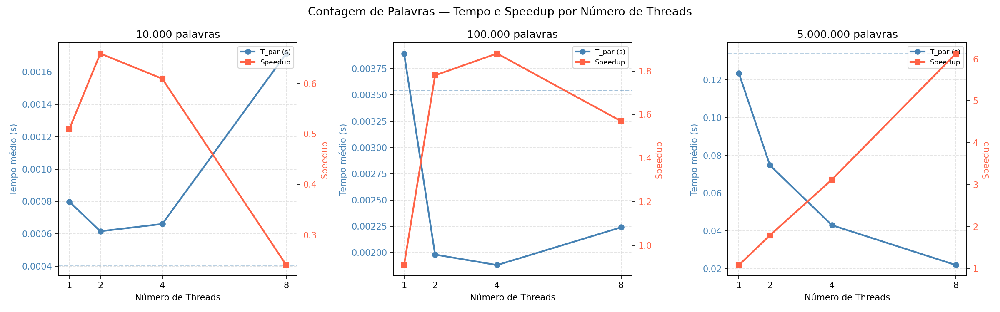

# Questão 1)

## Aluno

- **Matrícula:** 20240008181
- **Nome:** Vinícius Victor Lopes de Almeida

## Problema Escolhido

**P3 - Contagem de Palavras em um Arquivo Grande**

## Configuração do Computador

### Hardware

| Componente | Especificação |
|---|---|
| **Processador** | Intel Ultra Core 5 125U |
| **Núcleos Físicos** | 12 |
| **Threads Lógicas** | 14 |
| **Frequência Máxima** | 4.3 GHz |

### Sistema Operacional

| Componente | Especificação |
|---|---|
| **Sistema Operacional** | Windows 11 |
| **Subsistema Linux** | WSL (Windows Subsystem for Linux) |
| **Distribuição Linux** | Ubuntu 24.04 LTS |
| **Padrão de Thread** | POSIX threads (pthreads) |

## Estrutura de Arquivos

```
atividade-pratica/
├── Makefile              # Regras de compilação do projeto
├── plot.py               # Script Python para gerar o gráfico de speedup
├── inputs/
│   └── words.txt         # Arquivo de entrada gerado automaticamente
└── src/
    ├── main.c            # Ponto de entrada: orquestra medições e imprime resultados
    ├── create_input.c    # Gera o arquivo de palavras aleatórias em inputs/words.txt
    ├── data.c            # Lê o arquivo de entrada em memória
    ├── sequencial.c      # Contagem de palavras em modo sequencial
    ├── threads.c         # Contagem de palavras em modo paralelo com pthreads
    └── graficos/
        └── speedup.png   # Gráfico de speedup gerado pelo plot.py
```

## Compilação

**Execute o comando abaixo para compilar o projeto:**
```bash
make
```
Opções de Compilação Utilizadas

- `-O2`: Otimização de nível 2 para melhor desempenho
- `-Wall`: Habilita todos os avisos padrão
- `-Wextra`: Habilita avisos extras adicionais
- `-pthread`: Linka a biblioteca POSIX threads

**Execução**

```bash
./word_counter <num_palavras>
```

| Parâmetro | Descrição |
|---|---|
| `num_palavras` | Quantidade de palavras que serão geradas no arquivo de entrada |

O programa roda automaticamente com T = 1, 2, 4 e 8 threads e reporta corretude, tempo e speedup para cada configuração.

**Exemplo:**
```bash
./word_counter 10000
```

# Questão 2)

## Arquivo de entrada

Inicialmente tentei usar o [random.org](https://www.random.org/words/) para gerar uma lista de palavras aleatórias, mas acabei esgotando minha cota diária de requisições antes de conseguir o volume necessário. Por conta disso, criei um script em C para gerar o arquivo de entrada.

O arquivo é gerado pela função `create_input()` em `src/create_input.c`. Ela escreve as palavras em `inputs/words.txt`, com 5 palavras por linha, a partir de uma lista fixa de 10 palavras diferentes. As palavras são distribuídas de forma aleatória.

## Tempo Sequencial

| Parâmetro | Valor |
|---|---|
| **Tamanho da entrada** | 5.000.000 palavras |
| **T_seq (média 5 execuções)** | 0.134023 s |

# Questão 3)

## Resultados Paralelos

Medições feitas com média de 5 execuções (descartando 1 aquecimento), com `CLOCK_MONOTONIC`, entrada de 5 milhões de palavras.

| Threads | Palavras | Corretude | T_par (s) | Speedup |
|---------|----------|-----------|-----------|---------|
| 1       | 5000000  | OK        | 0.123537  | 1.08x   |
| 2       | 5000000  | OK        | 0.074752  | 1.79x   |
| 4       | 5000000  | OK        | 0.042994  | 3.12x   |
| 8       | 5000000  | OK        | 0.021848  | 6.13x   |

# Questão 4)

## Análise de Desempenho



O gráfico acima mostra o tempo de execução e o speedup para três tamanhos de entrada diferentes (10.000, 100.000 e 5.000.000 palavras) conforme o número de threads aumenta.

### Lei de Amdahl

Pela Lei de Amdahl, o speedup máximo que um programa pode atingir com paralelismo é limitado pela fração do código que **não pode** ser paralelizada. Quanto maior a parte sequencial do programa, menor será o ganho com mais threads, independentemente de quantos núcleos sejam usados. No caso da contagem de palavras, a maior parte do trabalho é paralelizável — cada thread processa sua fatia do buffer de forma independente —, o que explica o speedup crescente observado com 5 milhões de palavras.

### Overhead de criação de threads

Para entradas pequenas (10.000 palavras), o tempo de computação em si é de frações de milissegundo. O custo de criar e destruir threads a cada execução supera o tempo que seria economizado com o paralelismo, fazendo com que a versão paralela seja significativamente mais lenta do que a sequencial. Esse comportamento é visível no gráfico: com 10.000 palavras, o speedup fica abaixo de 1.0 em todas as configurações de threads, chegando a 0.24x com 8 threads. Somente com entradas grandes o suficiente o ganho de paralelismo compensa esse overhead.
